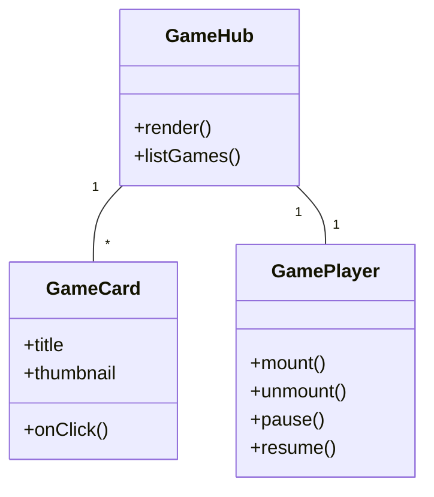

# 🎮 Elite Wednesday Games — Web Game Collection

[](https://elite-wednesday-games.vercel.app) [](https://github.com/evilshxt/games) [](LICENSE)

Polished collection of small, browser-first games and interactive experiments built with modern web tooling. Play immediately at the live demo — no cloning required: https://elite-wednesday-games.vercel.app

---

## Table of Contents
- [Overview](#overview)
- [Live Demo](#live-demo)
- [Features](#features)
- [Technologies](#technologies)
- [Games](#games)
- [How to View (No Clone Required)](#how-to-view-no-clone-required)
- [Local Development (Optional)](#local-development-optional)
- [Architecture & User Flow](#architecture--user-flow)
- [Contributing](#contributing)
- [License](#license)

---

## Overview

This repository is a curated set of web-based mini-games and interactive demos. Each game is contained within its own folder under `src/games/` and is designed to be lightweight, performant, and easily viewable from the hosted demo.

Live demo: https://elite-wednesday-games.vercel.app  
Repo: https://github.com/evilshxt/games

---

## Live Demo

Open the collection and play any game instantly — no clone, install, or build required:

- 🌐 Live site: https://elite-wednesday-games.vercel.app

---

## Features

| Feature | Description |
|---|---|
| 🎮 Instant Play | Play directly in the browser via the hosted demo (Vercel). |
| 📦 Multiple Game Modules | Each game is modular and lives in its own folder for easy maintenance. |
| ⚡ Modern Tooling | Built with React + Vite for fast loads and quick iteration. |
| 🎨 WebGL & 2D | Mix of 3D (R3F / Three.js) and performant 2D canvas/SVG experiences. |
| 🧭 Lightweight Routing | Simple game launcher UI to pick and play titles. |

---

## Technologies

- ⚛️ React
- ⚡ Vite
- 📘 TypeScript
- 🎭 (Optional) React Three Fiber / Three.js for 3D scenes
- 🎬 GSAP / Framer Motion for polished animations
- 🗂️ Zustand (or similar) for lightweight state when needed

---

## Games

### 🌌 Cosmic Drift (In Development)
A neon, high-speed **infinite wormhole runner** where players dodge obstacles, activate power-ups, and survive as long as possible.  
Features include:
- Procedural obstacle spawning
- Power-up collection system
- Dynamic difficulty scaling
- Immersive 3D visuals with post-processing effects

[Read more about Cosmic Drift](descriptions/cosmic-drift.md)

*More games coming soon!*

---

## How to View (No Clone Required)

1. Visit the live demo: https://elite-wednesday-games.vercel.app
2. Browse the game hub and click any game to load it in your browser.

That is all — no cloning or local setup is necessary to try the games.

---

## Local Development (Optional)

Follow these steps if you want to run the project locally for development or debugging.

Windows PowerShell example:

```powershell
# Clone (optional, only if you want a local copy)
git clone https://github.com/evilshxt/games.git ; cd games
npm install
npm run dev
# Open the local dev URL printed by Vite
```

Note: You don't need to run these steps to view the games — the live site is kept up-to-date.

---

## Architecture & User Flow

Below are simple diagrams showing the high-level architecture and the in-browser user flow. These are intentionally small and focused so contributors and reviewers can quickly understand how things fit together.

### High-level Architecture

```mermaid
flowchart LR
    subgraph Client
        A[Browser]
        B[React App (Vite bundle)]
        C[Game Modules (src/games/*)]
    end
    subgraph Hosting
        V[Vercel CDN]
        G[GitHub (source repo)]
    end
    A -->|loads URL| V
    V -->|serves static bundle| B
    B --> C
    G -->|push / CI| V
    classDef infra stroke:#333,stroke-width:1px;
    class V,G infra
```

### User Interaction Flow


### Component Overview



---

## Contributing

Contributions are welcome. If you'd like to suggest features or fix issues:

1. Open an issue describing the change.
2. Fork the repo and create a feature branch.
3. Submit a pull request with a clear description and screenshots (if applicable).

Please follow the repository's code style and keep changes minimal and focused.

---

## License

This project is provided under the MIT license. See `LICENSE` for details.

---

## Credits

- 🚀 Live deployment: Vercel
- 📂 Repo: https://github.com/evilshxt/games

---

## Notes

- Live demo is kept up-to-date at: https://elite-wednesday-games.vercel.app
- Source code and issues: https://github.com/evilshxt/games
